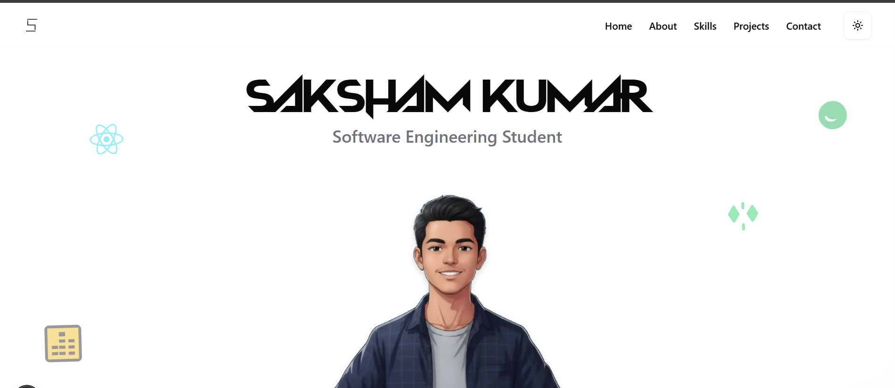

Saksham Kumar - Personal Portfolio
==================================



Welcome to the source code for my personal portfolio. This website is built from scratch using Next.js (App Router), TypeScript, and Tailwind CSS, with a strong focus on modern design, smooth animations, and a clean user experience.

It's designed to showcase my skills, projects, and experience as a Software Engineering student specializing in MERN stack development and AI/ML.

[View Live Demo](https://www.google.com/search?q=https://your-live-url.com)  (<-- Add your deployment link here!)

✨ Features
----------

-   Modern Tech Stack: Built with Next.js 15, React 19, and TypeScript for a fast, type-safe, and scalable application.

-   Sleek UI & Styling: Styled with Tailwind CSS and utilizing shadcn/ui components for a clean, professional, and consistent design system.

-   Dynamic Animations: Heavily features Framer Motion for:

-   Staggered, on-scroll entrance animations for all page sections.

-   A dynamic hero section with floating, animated skill icons.

-   Interactive project cards that play demo videos on hover.

-   A fully responsive, animated mobile navbar with a slide-out menu.

-   Project Showcase: Pulls project information directly from my resume, including descriptions, tech tags, and links to GitHub repositories.

-   Dark/Light Mode: Full theme support using next-themes and CSS variables.

-   Component-Based: Fully modularized into reusable components for each section (Hero, About, Skills, Projects, Contact).

🛠️ Tech Stack
--------------

This portfolio is built with a modern, performant, and maintainable tech stack:

-   Framework:  [Next.js](https://nextjs.org/) (App Router)

-   Language:  [TypeScript](https://www.typescriptlang.org/)

-   Styling:  [Tailwind CSS](https://tailwindcss.com/)

-   UI Components:  [shadcn/ui](https://ui.shadcn.com/) (built on [Radix UI](https://www.radix-ui.com/))

-   Animation:  [Framer Motion](https://www.framer.com/motion/)

-   Icons:  [Lucide React](https://lucide.dev/)

-   Theme:  [next-themes](https://github.com/pacocoursey/next-themes)

-   Linting: ESLint

🚀 Running Locally
------------------

To get a local copy up and running, follow these simple steps.

### Prerequisites

You must have [Node.js](https://nodejs.org/) (v18 or later) and npm installed on your machine.

### Installation

1.  Clone the repository:\
    ```
    git clone [https://github.com/sakshamkumar28/Saksham_Portfolio.git](https://github.com/sakshamkumar28/Saksham_Portfolio.git)
    ```
    ```
    cd Saksham_Portfolio
    ```
    

2.  Install dependencies:\
```
    npm install
```

3.  Run the development server:\
```
    npm run dev
```

4.  Open the app:\
    Open http://localhost:3000 with your browser to see the result.

🔧 Configuration
----------------

### Project Videos

The ProjectsSection component is set up to load videos from the public/videos/ directory.

1.  Create a folder named videos inside the public directory.

2.  Add your .mp4 or .webm demo videos (e.g., microx-demo.mp4).

3.  Update the videoUrl paths in app/components/ProjectsSection.tsx to match your filenames (e.g., /videos/microx-demo.mp4).

### External Images

The next.config.ts file is configured to allow images from i.pinimg.com and placehold.co. If you add images from other external domains, you must add their hostname to the remotePatterns array in next.config.ts and restart your development server.

```

// next.config.ts\
const nextConfig: NextConfig = {\
  images: {\
    remotePatterns: [\
      {\
        protocol: 'https',\
        hostname: 'i.pinimg.com',\
        // ... other domains\
      },\
    ],\
  },\
};

```
📞 Connect with Me
------------------

-   LinkedIn:  [linkedin.com/in/saksham-kumar-405a18288](https://www.google.com/search?q=https://linkedin.com/in/saksham-kumar-405a18288)

-   GitHub:  [github.com/sakshamkumar28](https://github.com/sakshamkumar28)

-   Email:  <kumarsaksham863@gmail.com>